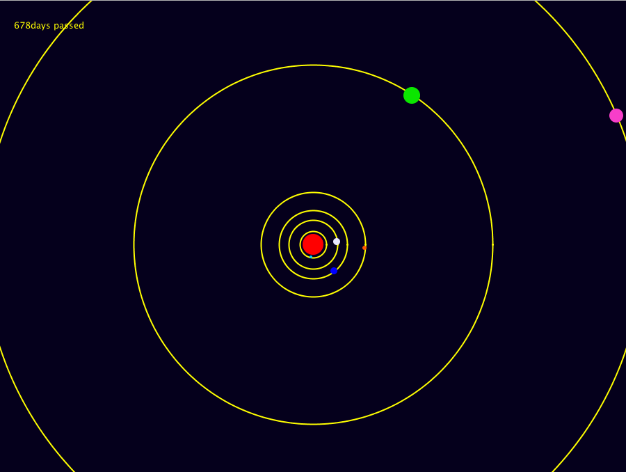
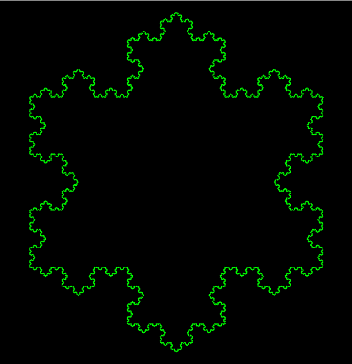
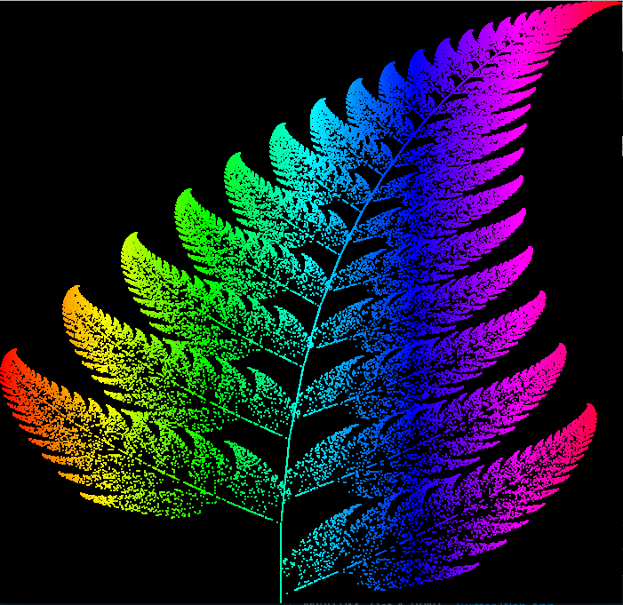

# CodeIt
CodeIt: inspired by TheCodingChallenge

# Introduction
CodeIt is a personal project where I code something attracting me. Almost all of these projects are written in Java with my drawing library, Moonlit. You can run these code by moving to the folder which you want to run and typing ```./build.sh```. You also add your own project by ```java Setup [index] [project name]```. Enjoy yourself coding!!

# Projects
Introduction of each project.
## #01-orbit
is a simulator of solar system. This is NOT a physical simulator which only draw a circle which goes around center circle.


## #02-pendulum
is a simulator of 100 penudulums. Formula is cited from [Here](http://godfoot.world.coocan.jp/furiko.htm) (Japanese page). I learnt differential equation and Runge–Kutta method, and I really was attracted by how interesting physics is.

## #03-double-pendulum
is a simulator of double pendulum which gives us a chaotic movement. Formula is cited from [Here](https://www.aihara.co.jp/~taiji/pendula-equations/present-node2.html) (Also Japanese page). We cannnot predict next movement of double pendulum so I enjoy wathing this really long time.
[](https://www.youtube.com/watch?v=gjmSGThwIYY)

## #04-mosaic-image
is a project for creating a memory of my sports day. How to create. First divide destination image into pieces whose size is 25x20(you can change this value, smaller size, higher quality image will be created but more time needed.). Calculate distance of RGB of each pixel of data images and divided image.

## #05-kochcurve
is a project which draw a koch curve(Koch snowflake). That's all.


## #06-dft
is a project which shows you how DFT(Discrete Fourier Transform) works. DFT translete non-subsequential data to complex number with frequency so we can show them as epicycles.

## #07-paint
is a project made for #08-dftdrawing. this is a painting application which prints where mouse pointer is on console log so you can get non-subsequential data.(bunch of points)

## #08-dftdrawing
is a project which has two epicycles to draw a picture with a single stroke. I have wanted to make this project since I watched something like this on Youtube so I am really happy to develop this project.
[](https://www.youtube.com/watch?v=Zhlw5U4BCYo)

## #09-barnsleyfern
is a project which draws a barnsleyfern. By calculating formula on [Wikipedia](https://en.wikipedia.org/wiki/Barnsley_fern), but I really don't understand why.


## #10-sortvisualization
is a project which shows how sort algorithm works with a color cycle. There are four type of sort algorithm: Bubble Sort, Quick Sort, Stalin Sort, Merge Sort. You CANNOT see which sort algorithm is fast because conditions are different each other.
[](https://www.youtube.com/watch?v=ICqBMIfkeYM)